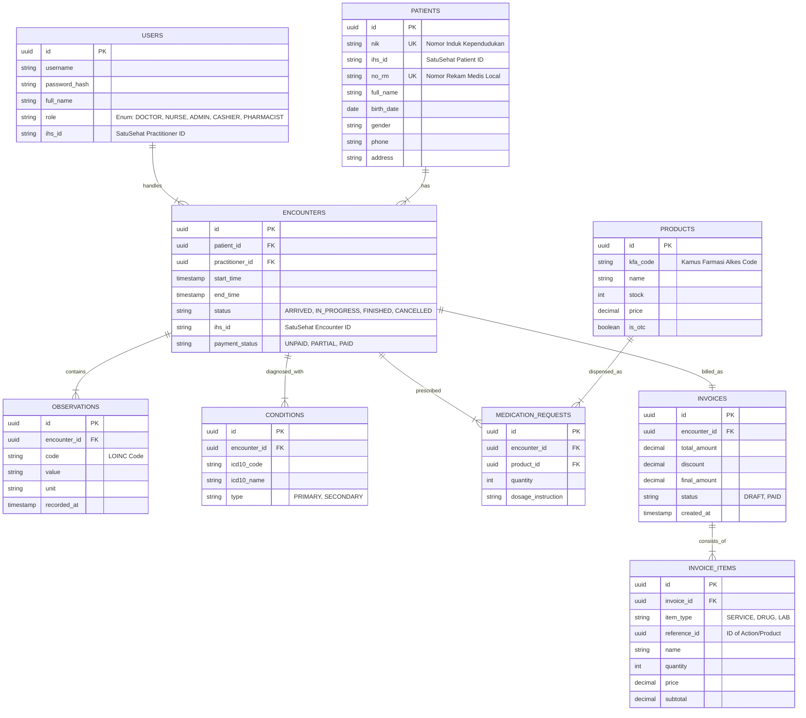

# APPLICATION DESIGN DOCUMENT
## PROYEK: SISTEM INFORMASI KLINIK TERINTEGRASI SATUSEHAT

### 1. STRUKTUR MENU & NAVIGASI (SITEMAP)

Sistem akan membagi menu berdasarkan Role User (RBAC).

#### A. Public / Common
*   **Login Page**: Username, Password.
*   **Dashboard**: Ringkasan data (Antrean Hari Ini, Pendapatan Hari Ini, Stok Kritis).

#### B. Front Office (Pendaftaran)
*   **Pendaftaran Pasien**:
    *   *Sub-menu: Pasien Baru (Input NIK)*
    *   *Sub-menu: Pasien Lama (Cari RM/Nama)*
*   **Daftar Kunjungan (Visit List)**: Monitor status pasien (Waiting, In-Consultation, Done).
*   **Jadwal Dokter**: View jadwal praktek.

#### C. Dokter (Medical Desk)
*   **Antrean Pasien**: List pasien yang menunggu di poli dokter tersebut.
*   **Rekam Medis (E-Medical Record)**:
    *   *History Pasien*
    *   *Input SOAP (Assessment)*
*   **E-Resep & Order**: Input resep dan permintaan lab/tindakan.

#### D. Perawat (Nurse Station)
*   **Triage / Vital Sign**: Input TTV sebelum pasien masuk ke dokter.
*   **Tindakan Keperawatan**: Input tindakan pendelegasian.

#### E. Farmasi (Apotek)
*   **E-Resep Masuk**: Queue resep dari dokter.
*   **Input Resep Manual**: Form untuk resep luar/manual.
*   **Penjualan Bebas (OTC)**: Kasir khusus obat bebas.
*   **Manajemen Stok**:
    *   *Kartu Stok*
    *   *Opname Stok*

#### F. Kasir (Billing)
*   **Tagihan Open**: List pasien yang belum lunas (Prepaid/Postpaid).
*   **Riwayat Transaksi**: Laporan pembayaran harian.

#### G. Administrator / Back Office
*   **Master Data**: User, Dokter, Poli, Jasa Medis, Data Obat/KFA.
*   **Laporan**: Kunjungan, 10 Besar Penyakit, Pendapatan, Stok Log.
*   **Settings**: Bridging SatuSehat (Client ID/Secret), Printer Config.

---

### 2. SPESIFIKASI FORM & INPUT

#### A. Form Pendaftaran Pasien Baru
*   **Input**:
    *   `NIK` (16 digit) -> *Cari SatuSehat*
    *   `Nama Lengkap` (Auto/Manual)
    *   `Tanggal Lahir` (Auto/Manual)
    *   `Jenis Kelamin` (Auto/Manual)
    *   `No HP / WhatsApp`
    *   `Alamat Domisili`
    *   `Penjamin` (Umum/BPJS/Asuransi Lain)
*   **Output**: Data Pasien Baru, Nomor Rekam Medis (Auto-generated).

#### B. Form Vital Sign (Perawat)
*   **Input**:
    *   `Sistole` / `Diastole` (mmHg)
    *   `Suhu Tubuh` (C)
    *   `Nadi` (x/menit)
    *   `Pernapasan/RR` (x/menit)
    *   `Tinggi Badan` (cm) & `Berat Badan` (kg) -> *Auto hitung IMT*
    *   `Lingkar Perut` (cm)

#### C. Form Pemeriksaan Dokter (SOAP)
*   **Subjective (S)**: Textarea keluhan pasien.
*   **Objective (O)**: Read-only Vital Sign + Textarea Pemeriksaan Fisik.
*   **Assessment (A)**:
    *   `Diagnosis Utama` (Autocomplete ICD-10) - *Wajib*
    *   `Diagnosis Sekunder` (Autocomplete ICD-10)
*   **Plan (P)**:
    *   `Tindakan` (Autocomplete ICD-9-CM / Master Tindakan)
    *   `Instruksi Medis` (Textarea)

#### D. Form E-Resep
*   **Input Item**:
    *   `Nama Obat` (Search Master Obat)
    *   `Jumlah`
    *   `Signa/Aturan Pakai` (3x1, Sesudah Makan, dll)
    *   `Rute Pemberian` (Oral, Injeksi, dll)
*   **Action**: Tambah ke list -> Simpan Resep.

#### E. Form Pembayaran (Kasir)
*   **View**: Detail Tagihan (Jasa Dokter, Tindakan, Lab, Obat).
*   **Input**:
    *   `Diskon` (Nominal/Persen) - *Optional*
    *   `Metode Bayar` (Tunai/QRIS/Debit)
    *   `Jumlah Bayar`
*   **Output**: Struk/Invoice, Status Lunas.

---

### 3. ENTITY RELATIONSHIP DIAGRAM (ERD)

Desain database relasional untuk mendukung fitur di atas.

